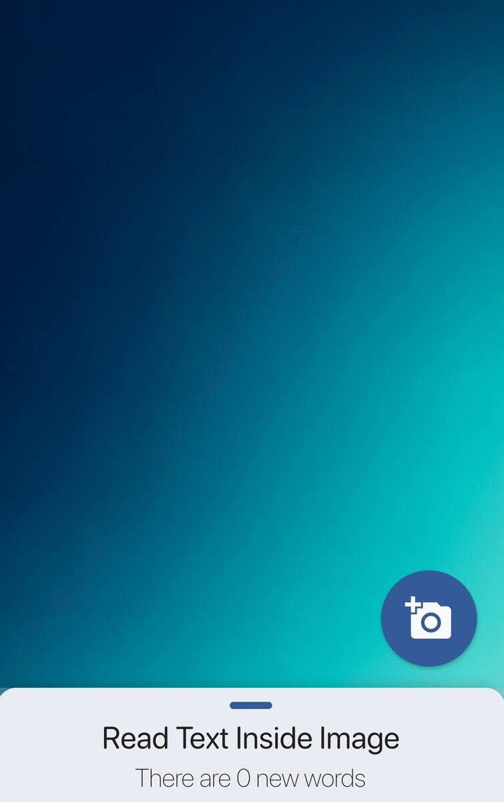
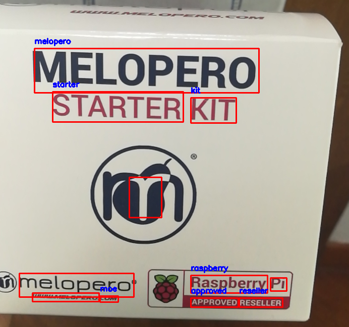
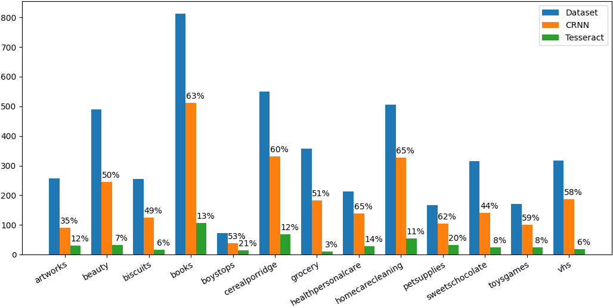

# Just Read It
## To read the unreadable 
We know that technology is increasing its support to our society day by day. This project is thought to be a part of this innovation process by providing a support to *blind people in going grocery shopping*.

### Recognize text in supermarket items
The task is to help blind people to read what they can not. Often supermarket items don't have a braille translation of their name and descriptions. We provide an app that can spot text in images, transcript it and read it with the phone's text-to-speech.

## Application
We have built a cross-platform application that allows a blind person to take a picture, to send it to a server that analyzes it, recieve the text found by the algorithms and read it through the smartphone's screen reader. A demo is shown where you can see how the app works: 
- the user presses the **camera button** and a photo is shot,
- after the results are returned by the server the app first of all shows the **three most relevant** words as a popup and reads them through the screen reader, 
- then the user is able to read all the words into a sliding window with a **table containing text** so that each table position is filled by the words found in the same position of the image.

## Implementation
We have integrated two different Neural Networks to complete our end-to-end OCR task:
- [CRAFT](https://github.com/clovaai/CRAFT-pytorch) for text detection,
- [CRNN](https://github.com/meijieru/crnn.pytorch) for text recognition. 

To test this system we have used the [mmm2018](https://github.com/jiang-public/MMM2018) dataset made by e-shop images with annotated text. 
The obtained results are promising, as we can see in the following histogram, but can be improved training those neural networks with custom data.

## Installation
### Frontend 
The frontend application is built with Flutter. You can import the frontend folder into an Android Studio project or into Visual Studio Code, launch in the terminal the command

	pub get 

to import all the required libraries and then run the project into your phone or into an Android or IOS virtual machine.

### Backend
The backend is entirely written in Python3. To make the project working you have to include libraries necessary for the two neural networks. You can find more informations into the relative folders (crnn and CRAFT) where the readme file of the original repository is left.
Moreover you have to install some more libraries to correctly execute the code and you can easily install all those requirements by executing the command 

	pip3 install -r requirements.txt

If you want to test your server with a real word environment you can use *ngrok* instead of having a static http server. Just in case you want to use the first method you have to install on your machine [ngrok](https://ngrok.com/download).

## Use
### Frontend 
You can use the system by an app provided in the folder or by the python file *uploadImg* where you can choose a picture from your computer, upload it to the server and read the response. The latter method has a testing purpose.

### Backend
To set up the server from the backend folder you can run the command:

	python3 server.py

and in another terminal of the same machine you have to run:
	
	ngrok http 8000

Then the ngrok terminal will show you your temporary http that you can reach from both the application and uploadImg.py. 
If you want only to test on your machine the neural networks without using the whole server infrastructure you can run:
	
	python3 computeDataset.py

that can be edit to fit all your purposes. At the moment three example uses are implemented:

- download the image from the dataset json file and analyze them in real time, uncomment line 15 - 22 (at the moment there is only one task, in future we should implement two concurrent task that do this job);
- analyze only the images without downloading them. This works only if in the images folder you put the previously downloaded images (you can do it using the file *backend/E-Shop Dataset/download_Marketdataset.py*), uncomment line 30 - 36;
- analyze single images, uncomment last line.

You can even use the single neural networks running:

	python3 crnnObjFlip.py
	python3 craftObj.py

## Test
As written previously we have tested the obtained results w.r.t. the mmm2018 dataset. Into the folder *backend/CRAFT-pytorch-master* you can find:

- *metrics.py* that allows to compare all the found bounding boxes with the dataset ones with the intersection over union parameter. This produces a json file IOU.json where each bounding box found is associated with the most likely dataset bounding box.
- *DDM_result.py* that interprets the IOU.json file produced previously and returns graphics, histograms and tables about the obtained results.

We have tested CRNN against Tesseract, another OCR algorithm, obtaining promising results as we can see in the following histogram.
Results can be improved training CRNN and CRAFT neural networks with custom data tailored for our specific problem.

